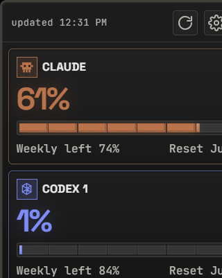
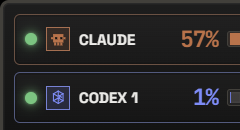

<div align="center">


# UsageView

**A floating desktop widget that shows your Claude and Codex usage at a glance.**
Windows-first · Tauri v2 + React · no API key, no browser-cookie import.


&nbsp;&nbsp;


</div>

## What it does

You log in **inside the app's own embedded WebView** — sessions stay local, no API keys.
For each account it reads the provider's **own internal usage JSON** (the same request the site
makes) and shows **% used**, **weekly left %**, and **reset time**.

- **3 accounts:** Claude, Codex, and a second isolated Codex session.
- **Auto-refresh** on launch and every *N* seconds (default 60), even while hidden to the tray.
  A maxed-out account backs off automatically until near its reset.
- **Reset countdown:** tap a tile (or the square logo in Mini) to flip it to a live `H:MM:SS`
  countdown; it flips automatically when an account hits 100%.
- **Full-tile gray-out** when an account is maxed, in every theme.

## Views & themes

- **Full view** — header + rich account tiles.
- **Mini view** — a compact row per account; drag anywhere to move, tap a logo for its countdown.
- **Themes** — Pixel (light/dark) and Glass (light/dark).
- Frameless, transparent, **always-on-top**, tray icon, drag-anywhere, single-instance.

## Build / run (Windows)

Requires Node/npm, WebView2 (preinstalled on Win11), and Rust/Cargo.

```powershell
npm install
npm run tauri dev      # develop
npm run tauri build    # exe + MSI + NSIS bundles in src-tauri/target/release
```

## How usage reading works (short)

A hidden per-provider WebView (logged in via your session) runs a small script that `fetch`es the
provider's internal usage endpoint and sends the parsed values back to the widget. It only ever
**reads** your own usage — no automation, no API key.
